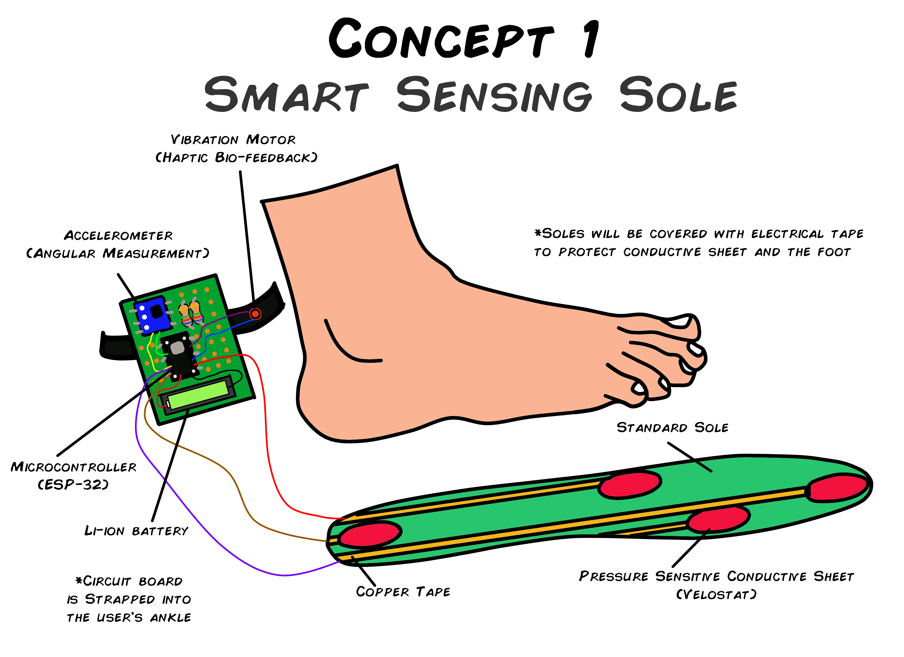
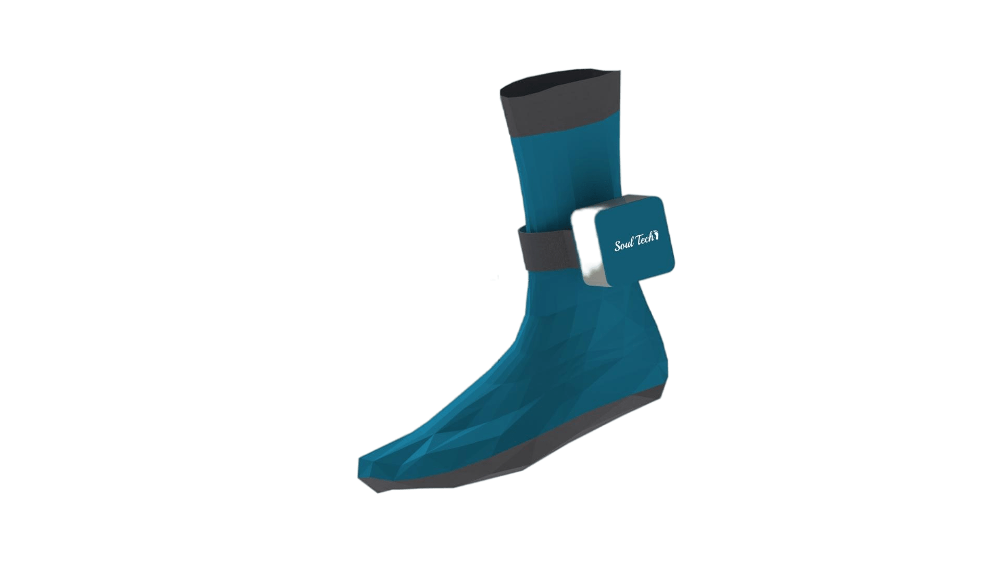
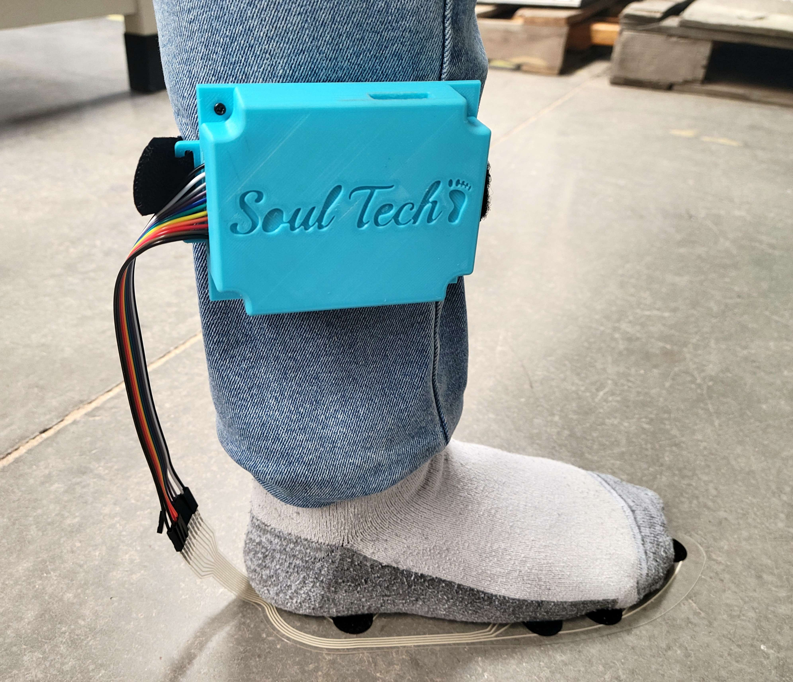
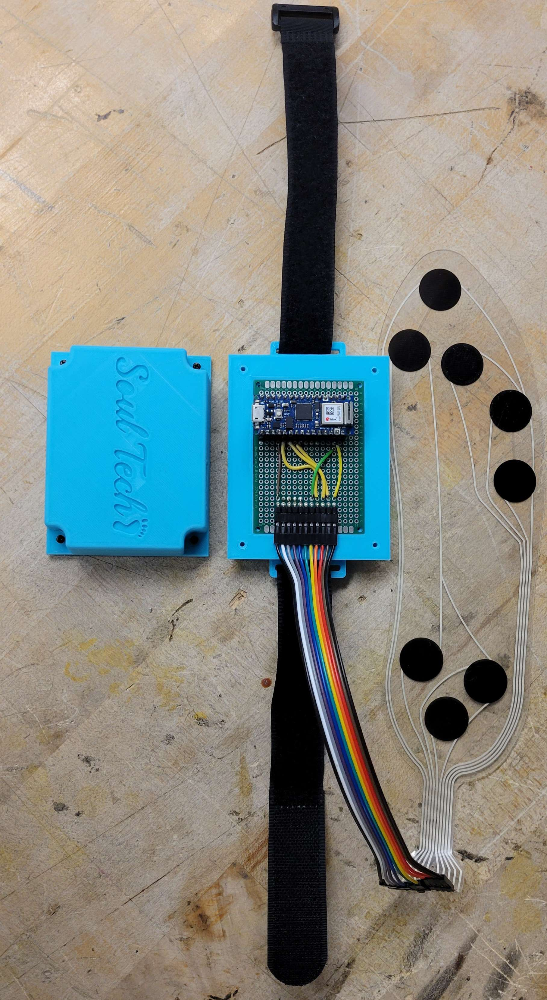
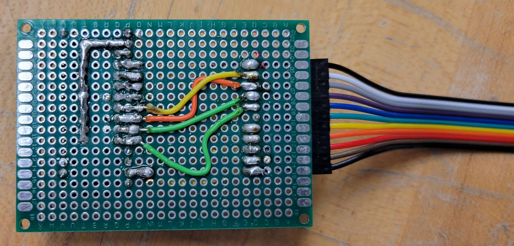

#  Portable Gait Analysis Device
The SoulTech aims to expand and apply the knowledge of the real engineering industry to develop a compact and portable embedded system for gait analysis and provide real-time therapy feedback to doctors and improve gait balance for patients at the Barrow Institute.  

&nbsp; &nbsp; &nbsp;&nbsp; &nbsp; &nbsp;
  
##   Proposed Concepts  

### Sole

The sole mainly consists of a conductive sensing material such as a Velostat that will act as a pressure sensor. These will be connected to copper tape to transmit the analog signal generated from the sensed pressure to a wire connected to the microcontroller. The conductive sensing materials will be placed at specific points that the foot normally comes into contact with while walking. The soles will then be covered with electrical tape to protect the sensors as well as the user's feet. The microcontroller will be placed in a separate housing with a daughterboard, vibrator, and accelerometer that will be strapped near the user's ankle. The vibrator will be used for bio-feedback purposes.   

### Socks  

Pressure-sensitive socks are made of washable and comfortable microfibre laced with Velostat (a thin pressure-sensitive material) to relay the data required to the microcontroller through copper strips. Team will try to infuse the controller, and IMU into the socks but if it's not possible, they will be attached to the sock using a detachable casing. These detachable casings will be sold separately thereby reducing the recurring costs if they break. Haptic feedback will be given using small vibration devices.

## CAD Designs
Pressure-sensitive socks are made of washable and comfortable microfibre laced with Velostat to relay the data required to the microcontroller through copper strips. These are connected to copper tape to transmit the analog signal generated from the sensed pressure to a wire connected to the microcontroller. The conductive sensing materials are placed at specific points that the foot normally comes into contact with while walking. The microcontroller is placed in a separate housing with a daughterboard, linear vibration motor, and accelerometer that is strapped near the user's ankle. These detachable casings are sold separately thereby reducing the recurring costs if they break. Haptic feedback is given using small linear vibration motor devices. The team will make sure that all embedded devices are sealed properly so that the device can be cleaned regularly.

 

## Requirements
### Functional Requirements
- Pressure sensing: The socks must accurately measure the pressure (weight) applied on the patient's foot with each step to determine weight distribution.
- Bio-feedback: The haptic feedback should be clear and easily distinguishable by the user to provide meaningful feedback on their gait.
- Initial contact detection: The socks should be able to detect which part of the foot made initial contact with the ground during walking.
- Stance time and stance length measurement: The socks must accurately measure the amount of time the foot is in a stance phase and the length of the stance phase.
- Stride measurement: The socks must measure the length of each stride and the number of strides taken during a given period.
- Cadence measurement: The socks must measure the rate at which the user walks to determine their cadence.
- Spatial characteristics measurement: The socks must accurately measure the distance traveled and movement angles by the user during the gait analysis.
- Durability: The socks should be able to withstand repeated use and be made of materials that are easy to clean after each use.
- Data collection and storage: The socks should have the ability to store data or transmit live data for further analysis and sharing with healthcare providers.

### Performance Requirements
- Accuracy: The socks should be able to accurately measure the pressure applied on the patient's foot during gait analysis.
- Precision: The socks should provide precise measurements of the patient's walking pattern, stance phase time, initial contact, and time shift.
- Sensitivity: The socks should be sensitive enough to detect where pressure is distributed.
- Speed: The socks should provide live data to the therapist and patient, with minimal lag time.
- Reliability: The socks should have consistent performance over time, without noticeable degradation.
- Durability: Regular wear and use should not damage the socks.
- Compatibility: Various sizes and styles of footwear should be compatible with the socks.
- Portability: The socks should be lightweight and portable, allowing for easy transport and use in a variety of settings.
- Connectivity: Data collection and analysis should be possible through wireless connections between socks and a computer or mobile device.
- Power efficiency: The socks should have a long battery life and be energy-efficient to reduce the need for frequent charging or replacement of batteries.

### Usability Requirements
- Easy to put on and take off: Socks must be designed to be easy to put on and take off so as not to cause discomfort or harm to the user. 
- Comfortable: Socks should be made of soft, breathable material to ensure maximum comfort during use.
- Secure fit: Socks must fit securely to prevent them from slipping or moving during use, which can affect the accuracy of the data collected.
- Easy to clean: socks must be easy to clean after each use to maintain good hygiene and prevent the spread of infections.
- User-friendly interface: The device must have a user-friendly interface so that both the user and the therapist can easily interpret the collected data.
- Light and portable: The device should be light and portable so that it can be easily carried and used in various situations. 
- Durability: Socks must be durable and long-lasting to withstand regular use without breaking or losing precision. 
- Compatibility: The socks must be compatible with multiple devices and software to easily integrate with existing healthcare systems.

## Block Diagram

## Implimentation

 

### Calculating Gait Characteristics
- Pressure
- Stance time
- Point of contact
- Stance
- Stride Length 
- Stride Width 
- Cadence 
- Spatial Characteristics

https://user-images.githubusercontent.com/96451759/234762332-7743c3fe-cdfe-4230-942c-10e17a4d2a56.mp4

