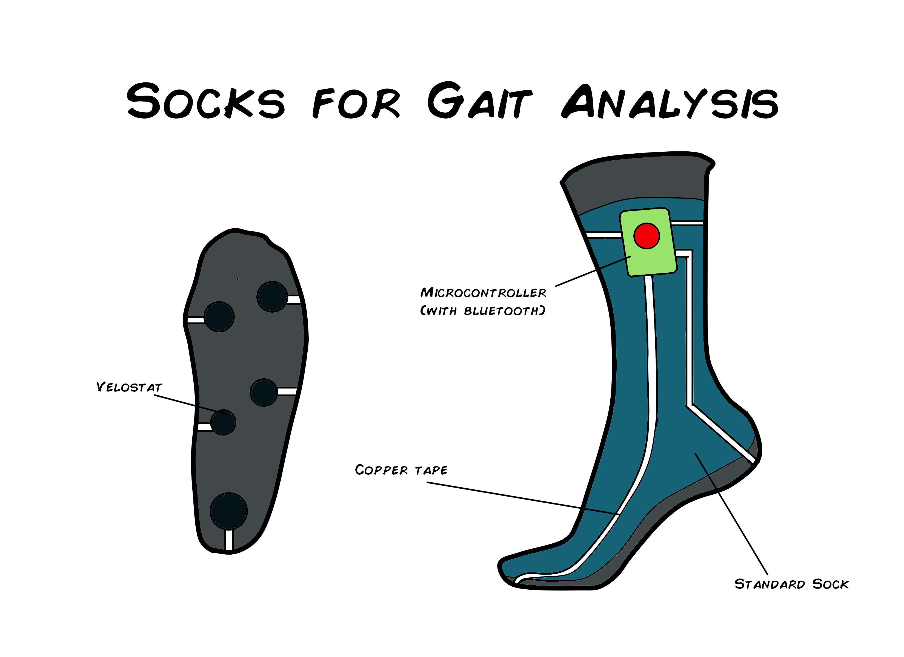

# -Portable-Gait-Analysis-Device
The team aims to expand and apply the knowledge of the real engineering industry to develop an compact and portable embedded system for gait analysis and provide real-time therapy feedback to doctors and improve gait balance for patients at the Barrow Institute.
  
## Proposed Concepts

## CAD Designs

